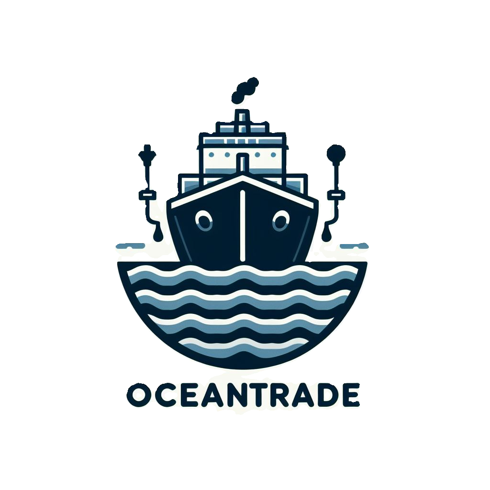

# OCEANTRADE: React Frontend with Python Backend

<div style="display: flex; justify-content: center; align-items: center; height: 100vh;">
    
</div>

Welcome to our React app with a Python backend! This README will guide you through the setup and usage of our project.


## Table of Contents

1. [Introduction](#introduction)
2. [Installation](#installation)
3. [Usage](#usage)
4. [Features](#features)

## Introduction

This project is a combination of a React frontend and a Python backend, providing a seamless user experience with powerful backend functionality.

## Installation

To get started, follow these steps:

1. Clone this repository to your local machine using:

   ```bash
   git clone https://github.com/DimitarTrajkov/AFK-DRAGONHACK2024.git
   ```

2. Navigate to the project directory:

   ```bash
   cd AFK-DRAGONHACK2024
   cd afk-dragonhack
   cd src
   ```

3. Install the necessary dependencies for the frontend using npm:

   ```bash
   npm install
   ```

4. Install the necessary dependencies for the backend. Make sure you have Python installed on your system.

   ```bash
   cd ..
   pip install -r requirements.txt
   ```

## Usage

Once you have installed the dependencies, you can start the frontend and backend servers.

### Frontend

To start the React frontend, run:

```bash
npm start
```

### Backend

To start the Python backend, run:

```bash
python server.py
```

## Features

### What the App Does

Our application, titled **OCEANTRADE**, is designed to track ships carrying oil across the world's oceans and utilize this data, alongside insights from an advanced AI prediction model, to forecast fluctuations in the oil market. Leveraging a sophisticated algorithm, our app analyzes the speed of oil delivery by these ships and correlates it with market trends to provide insights into future price movements.

### Tracking Ships

The app continuously monitors the movement of oil tankers across various maritime routes. By gathering real-time data on vessel positions, routes, and speeds, it builds a comprehensive picture of the global oil shipping network.

### Predicting Market Fluctuations

Using advanced predictive modeling techniques, our app interprets the speed of oil deliveries as a leading indicator of market conditions. By analyzing historical data and current shipping patterns, it generates forecasts on oil supply and demand dynamics, enabling users to anticipate market shifts with greater accuracy.

### User Interface

The frontend interface offers users an intuitive platform to access and interact with the app's features. Through dynamic visualizations and customizable dashboards, users can explore historical trends, view real-time shipping data, and receive predictive insights into the oil market.

### Backend Processing

Behind the scenes, our Python backend orchestrates the collection, processing, and analysis of vast amounts of shipping and market data. Leveraging cutting-edge algorithms and machine learning techniques, it transforms raw data into actionable insights, ensuring high performance and reliability.

### Key Features

- **Real-Time Ship Tracking:** Gain visibility into the current location and movement of oil tankers worldwide.
- **Market Predictions:** Receive forecasts and predictions on future oil market trends based on shipping data analysis.
- **Real-Time News Updates:** Stay informed with real-time updates on news and trends affecting the global oil market.
- **Customizable Dashboard:** Tailor the app's interface to suit your specific monitoring and analysis needs.
- **Historical Data Analysis:** Explore historical trends and patterns in oil shipping and market dynamics for informed decision-making.

With our app, users can stay ahead of the curve in the dynamic and complex world of the oil market, making smarter decisions backed by data-driven insights.
